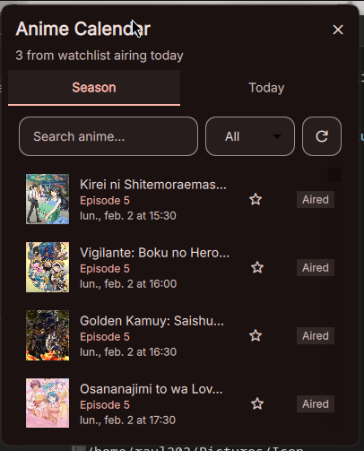
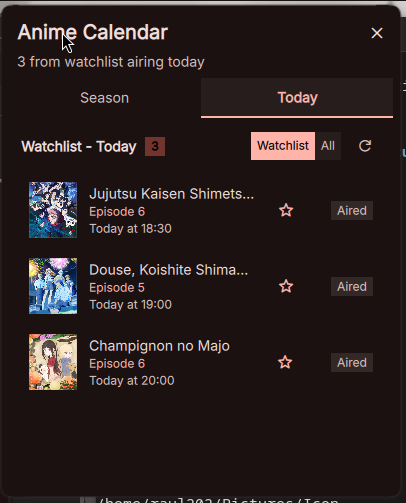
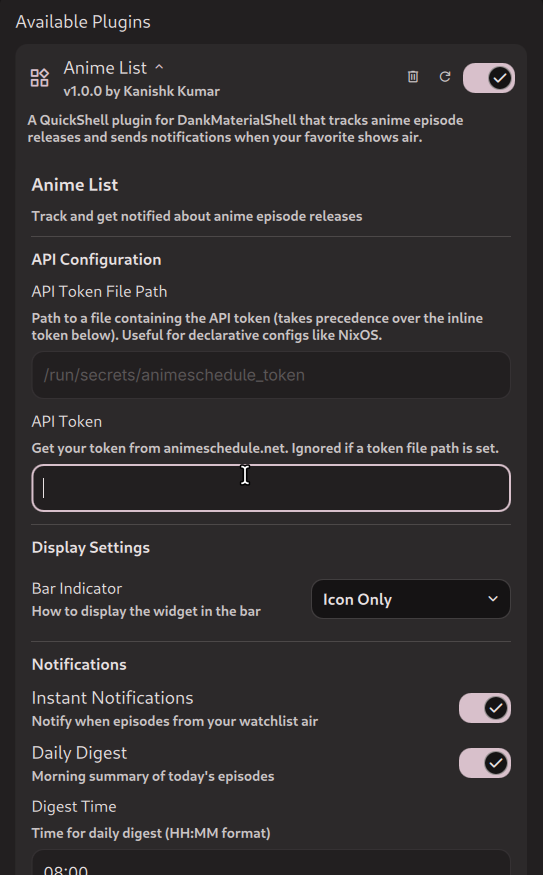

# Anime List Plugin

A QuickShell plugin for DankMaterialShell that tracks anime episode releases and sends notifications when your favorite shows air.

## Features

- **Season Overview** - Browse all anime airing this season
- **Watchlist Management** - Add/remove anime to your personal watchlist
- **Today's Schedule** - See which watchlist anime are airing today
- **Desktop Notifications** - Get notified when episodes air
    - Instant notifications when an episode starts
    - Daily digest summary of today's episodes
- **Customizable Bar Indicator** - Choose between icon only, icon + count, or icon + countdown
- **Custom Notification Icon** - Use your own icon for notifications

## Screenshots

### Season Tab



### Today Tab



### Settings



## Requirements

- [QuickShell](https://github.com/outfoxxed/quickshell)
- [DankMaterialShell](https://github.com/your-repo/DankMaterialShell)
- An API token from [animeschedule.net](https://animeschedule.net)
- `notify-send` (for desktop notifications)

## Installation

1. Clone or copy this plugin to your DankMaterialShell plugins directory:

    ```
    ~/.config/DankMaterialShell/plugins/AnimeList/
    ```

2. Enable the plugin in DankMaterialShell settings

3. Get your API token from [animeschedule.net](https://animeschedule.net) and add it in the plugin settings

## Configuration

### API Configuration

| Setting   | Description                      |
| --------- | -------------------------------- |
| API Token | Your animeschedule.net API token |

### Display Settings

| Setting       | Description                                                             |
| ------------- | ----------------------------------------------------------------------- |
| Bar Indicator | How to display in the bar: Icon Only, Icon + Count, or Icon + Countdown |

### Notifications

| Setting               | Description                                  |
| --------------------- | -------------------------------------------- |
| Instant Notifications | Notify when episodes from your watchlist air |
| Daily Digest          | Morning summary of today's episodes          |
| Digest Time           | Time for daily digest (HH:MM format)         |
| Notification Icon     | Icon name or path for notifications          |

### Data Settings

| Setting          | Description                                    |
| ---------------- | ---------------------------------------------- |
| Refresh Interval | How often to check for new episodes (5-60 min) |

## Usage

1. **Browse Season Tab** - See all anime airing this season
2. **Add to Watchlist** - Click the star icon on any anime to add it to your watchlist
3. **Check Today Tab** - View your watchlist anime airing today
4. **Toggle View** - Switch between "Watchlist" (today only) and "All" (full watchlist)
5. **Receive Notifications** - Get notified when your anime airs

## File Structure

```
AnimeList/
├── Widget.qml           # Main plugin component
├── Settings.qml         # Plugin settings UI
├── components/
│   ├── SeasonTab.qml    # Season overview tab
│   ├── TodayTab.qml     # Today's anime tab
│   ├── AnimeListItem.qml # Anime list item component
│   └── LoadingState.qml  # Loading indicator
├── services/
│   ├── AnimeScheduleService.qml  # API and data management
│   └── NotificationService.qml   # Notification handling
└── screenshots/         # Screenshots for README
```

## Watchlist Storage

Your watchlist is stored locally at:

```
~/.config/quickshell/anime-watchlist.json
```

## License

MIT License

## Credits

- Anime data provided by [animeschedule.net](https://animeschedule.net)
- Built for [DankMaterialShell](https://github.com/your-repo/DankMaterialShell)
